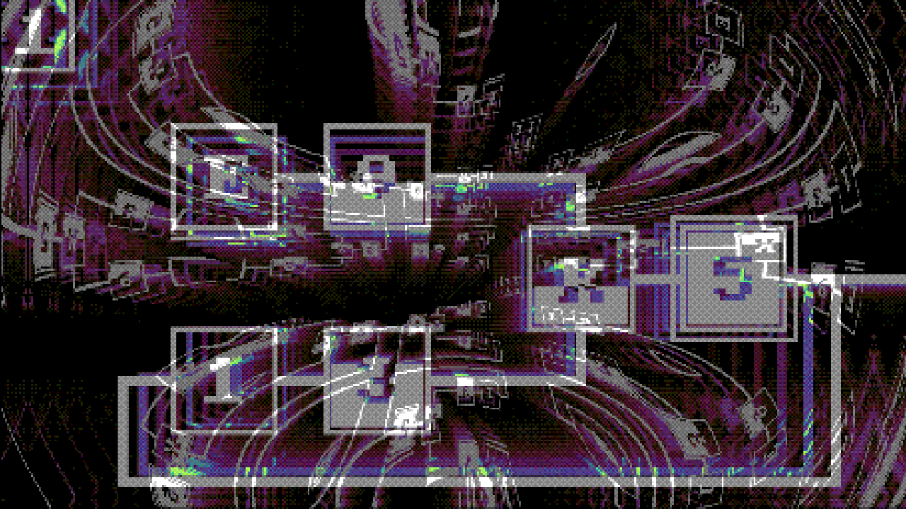
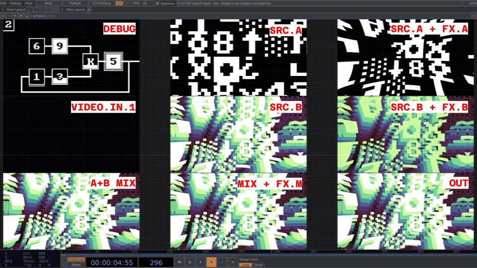
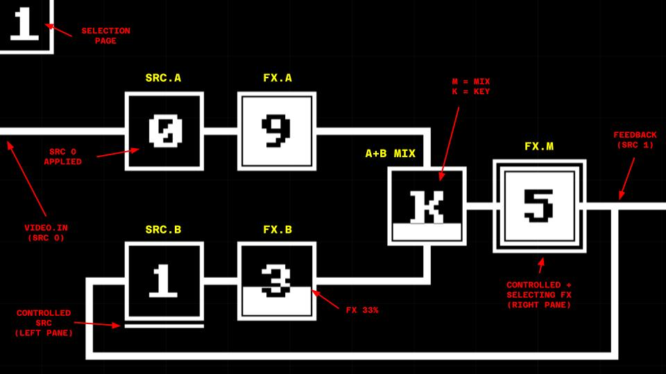
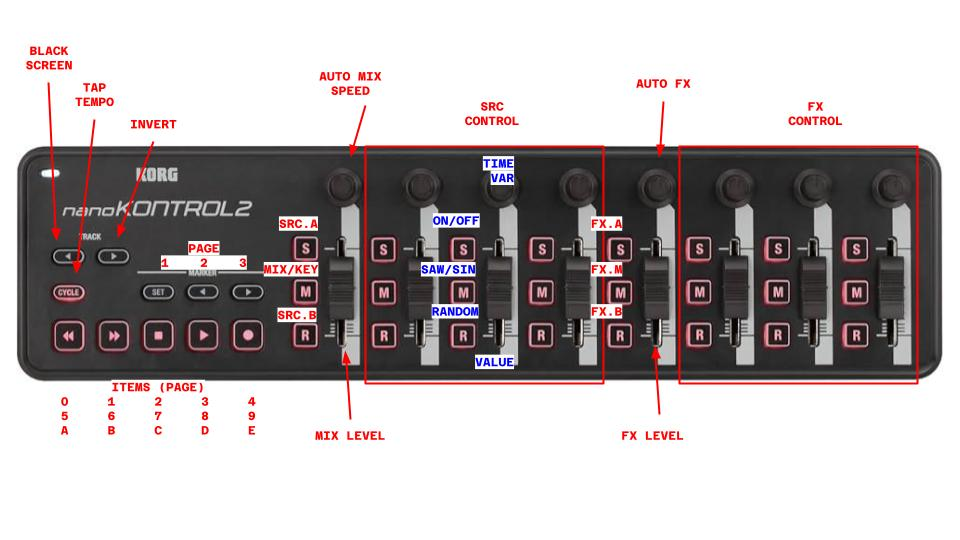

# TouchDesigner GLSL

**Shader-based video generator and mixer**

## Sources and Effects

| P     | #     | SRC               | _COL2_            | _COL3_          | _COL4_             | FX               | _COL6_          | _COL7_        | _COL8_         |
| ----- | ----- | ----------------- | ----------------- | --------------- | ------------------ | ---------------- | --------------- | ------------- | -------------- |
| **1** | **0** | Video In 1 + Thru | _Hue_             | _Saturation_    | _Light_            | Thru             | _Hue_           | _Saturation_  | \_Light        |
|       | **1** | Feedback + Shift  | _Zoom / Dezoom_   | _X Shift_       | _Y Shift_          | Feedback + Shift | _Zoom / Dezoom_ | _X Shift_     | _Y Shift_      |
|       | **2** | Lines             | _Thick. / Dezoom_ | _Rotation_      | _Distortion_       | Shift            | _Zoom / Dezoom_ | _X Shift_     | _Y Shift_      |
|       | **3** | Dots              | _Zoom_            | _Rotation_      | _Lens_             | Colorize         | _Black Color_   | _White Color_ | _Shift_        |
|       | **4** | Waves             | _Spacing_         | _Thickness_     | _Vert. Scroll (R)_ | Quantize         | _Pixel Size_    | _Bit Depth_   | _Blur_         |
| **2** | **5** | Video In 2 + Thru | _Hue_             | _Saturation_    | _Light_            | Dithering        | _Pixel Size_    | _Bit Depth_   | _Blur_         |
|       | **6** | Noise             | _Zoom_            | _Voronoi dist._ | _Details_          | TV               | _Lens_          | _Horz. Noise_ | _Dezoom_       |
|       | **7** | CP437             | _Zoom_            | _Charset_       | _Char. Delta_      | Kaleidoscope     | _Axes_          | _Rotation_    | _Horz. Scroll_ |
|       | **8** |                   |                   |                 |                    | CP437            | _Zoom_          | _Charset_     | _Char. Delta_  |
|       | **9** |                   |                   |                 |                    | Lens             | _Lens limit_    | _Lens power_  | _Pre Zoom_     |
| **3** | **A** | NDI In + Thru     | _Hue_             | _Saturation_    | _Light_            |                  |                 |               |                |
|       | **B** |                   |                   |                 |                    |                  |                 |               |                |
|       | **C** |                   |                   |                 |                    |                  |                 |               |                |
|       | **D** |                   |                   |                 |                    |                  |                 |               |                |
|       | **E** | Debug             | ---               | ---             | ---                |                  |                 |               |                |

## TOP Previews

> Note: Video In 2 and NDI not shown on previews

## Debug View

## NanoKontrol2 Controller mapping

> In blue is a sample "stage" as most sources/effects use a combination of 4 stages (see table above)
